# Blog
A blogging platform built with the Django framework is a technology-focused web application designed for creating, publishing, and managing blog posts. It offers a user-friendly content management system for bloggers. Users can sign up to follow authors they find interesting, and if inspired, they can start posting their own new tech content on the platform.

## Features
- Sign Up
- Log In
- Manage Posts
- Follow (or) Unfollow Authors
- Update Profile
- Change Password
- Change Email Address
- Two Factor Authentication

## Installing
### Clone the project

```bash
git clone https://github.com/shivatejaburle/blog-102
cd blog-102
```

### Setup your Virtual Environment
```bash
pip install virtualenv
virtualenv venv
# For Windows
venv\Scripts\activate   
# For Mac
source venv/bin/activate 
```

### Install dependencies
```bash
pip install -r requirements.txt
```

### Environment Settings

Create `blog-102/.env` to store Email Configurations.

```bash
EMAIL_BACKEND = 'django.core.mail.backends.smtp.EmailBackend'
EMAIL_HOST = '<YOUR_SMTP_HOST>'
EMAIL_PORT = <YOUR_PORT_NUMBER>
EMAIL_USE_TLS = <True_OR_False>
EMAIL_HOST_USER = '<YOUR_EMAIL_ADDRESS>'
EMAIL_HOST_PASSWORD = '<YOUR_PASSWORD>'
```

### Collect static files (only on a Production Server)

```bash
python manage.py collectstatic
```

### Running a Development Server

Just run this command:

```bash
python manage.py runserver
```
Your application will be available @ http://127.0.0.1:8000/

### Login Information
- **Test User**: 
    - Username : testuser
    - Password : test_12345

## Screenshots
### Home Page
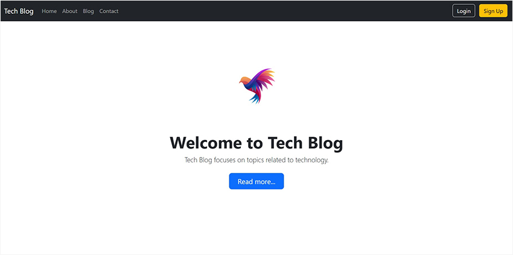
### Blog
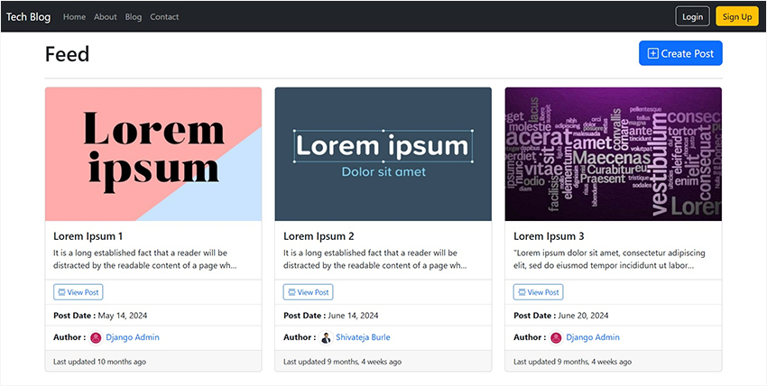
### Sign Up
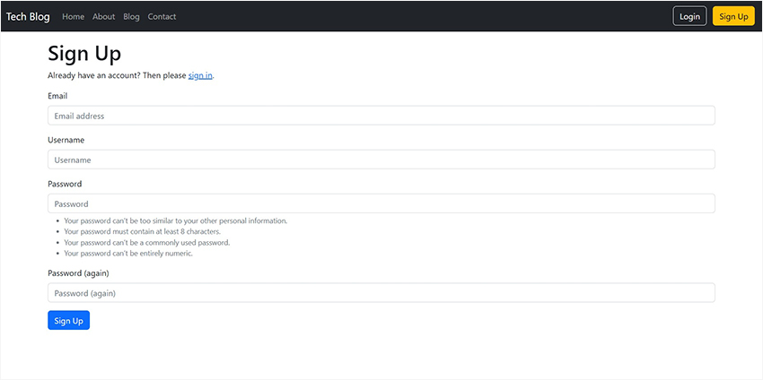
### Login
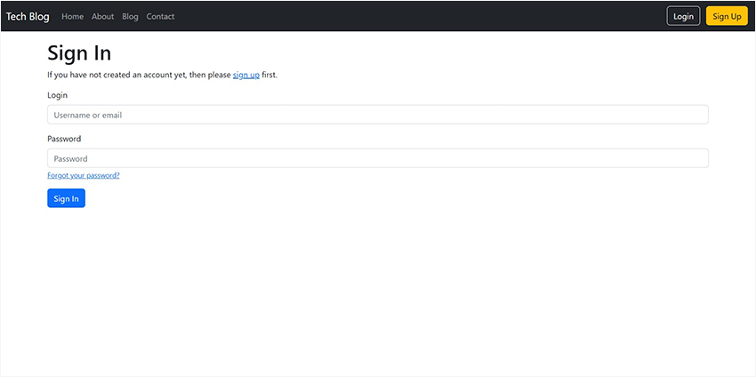
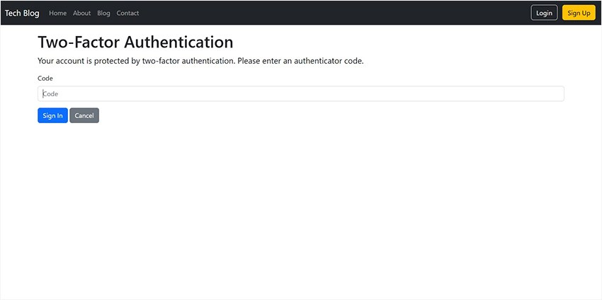
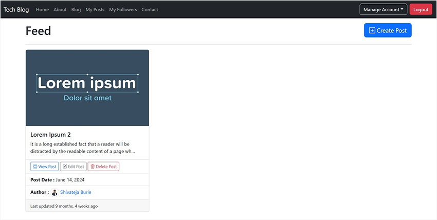
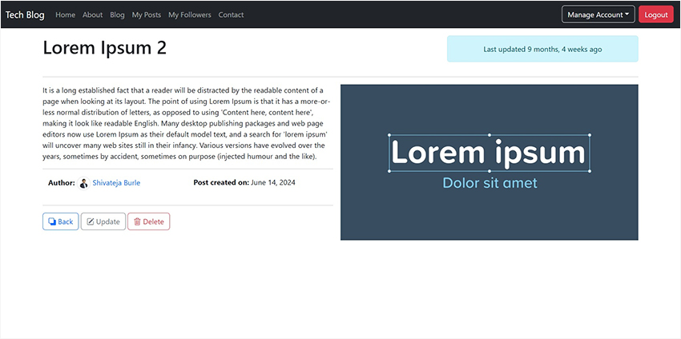
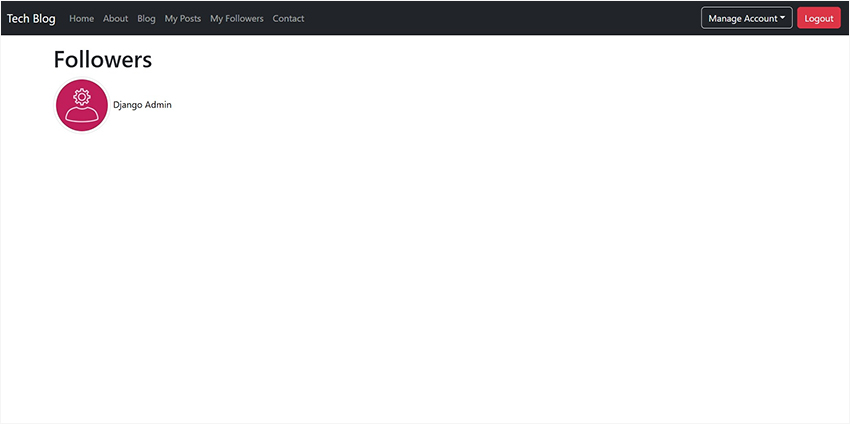
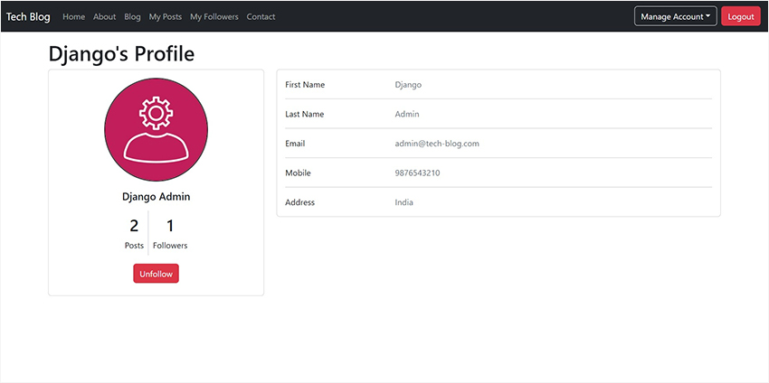
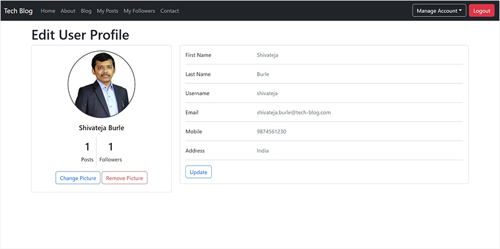
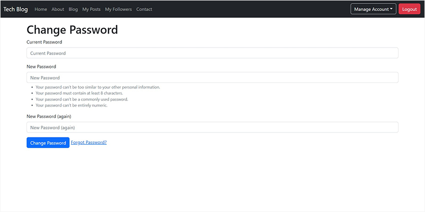
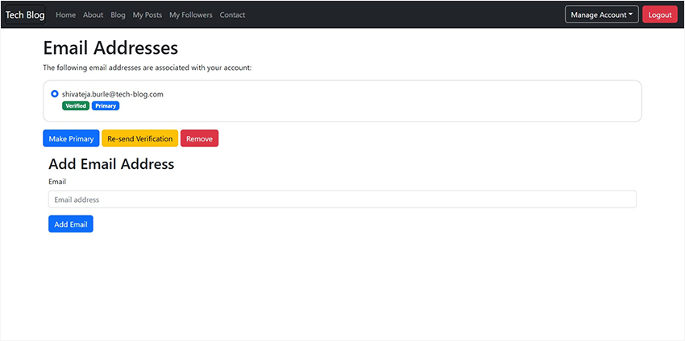
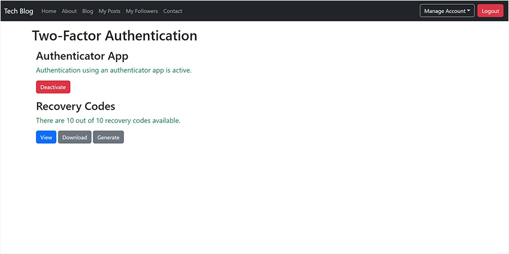
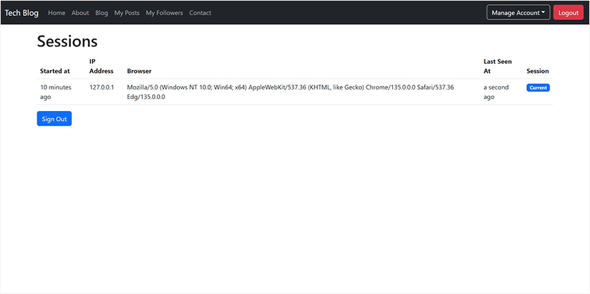
### Mobile View
&emsp;&emsp;&emsp;&emsp;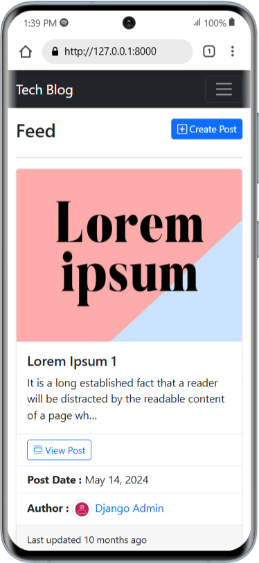

&emsp;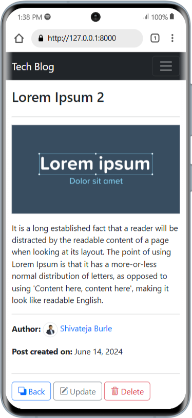&emsp;&emsp;&emsp;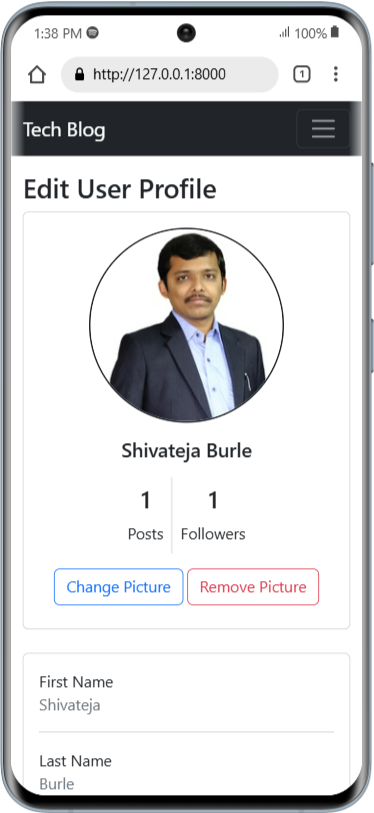

**Note:** All pages are responsive with small, medium and large devices.
